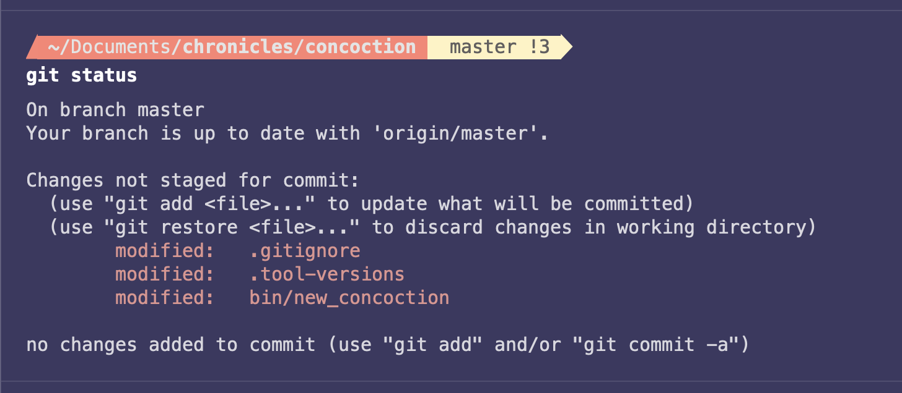

## Dotfiles



## Subdirectories explained

- `Brewfile`: Blueprint that contains all the formulaes and casks I use daily;
- `topic/*.zsh`: Files loaded by `.zshrc` during the execution of the `install` script;
- `topic/*.symlink`: Files with `*.symlink` extension get symlinked into your `$HOME`.

## Install

```sh
  git clone https://github.com/pedroseabra1091/dotfiles.git ~/.dotfiles
  cd ~/.dotfiles
  sh install
```

The `install` script symlinks the appropriate files to your home directory which makes everything controllable via `~/.dotfiles`.

Additionally, it fine tunes the macOS dock to my preferences.

> [!TIP]
> Check [mac-defaults](https://macos-defaults.com) for further tuning of your macOS UI setup.

> [!WARNING]
A few unicode characters aren't correctly displayed on iterm2. In order to fix it, set the default font to the pre-installed `Hack Nerd Font Mono`.

